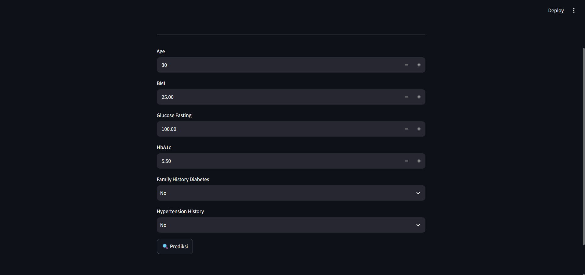

# 🩺 Diabetes Prediction System

A machine learning project for predicting diabetes using the Random Forest algorithm and Streamlit.

---

## 📌 Overview

This project aims to predict whether a patient has diabetes based on several health indicators such as age, BMI, fasting glucose, HbA1c, family history of diabetes, and hypertension history.

The prediction model was built using the Random Forest algorithm and deployed with Streamlit to provide an interactive prediction interface.

---

## 🚀 Features

- Data preprocessing
- Label Encoding
- Random Forest Classification
- Model Evaluation
- Streamlit Web Application

---

## 🛠️ Technologies Used

- Python
- Pandas
- NumPy
- Scikit-learn
- Streamlit
- Joblib

---

## 📊 Model Performance

| Metric | Result |
|---------|---------|
| Algorithm | Random Forest |
| Accuracy | **91.81%** |

---

## 📂 Project Structure

```
diabetes-prediction-system/
│
├── app.py
├── diabetes_prediction.ipynb
├── diabetes_dataset.csv
├── label_encoder.pkl
├── requirements.txt
├── README.md
└── screenshots/
    └── app-preview.png
```

---

## 📸 Application Preview



---

## ▶️ How to Run

Clone this repository.

```bash
git clone https://github.com/ArvyAja/diabetes-prediction-system.git
```

Install the required libraries.

```bash
pip install -r requirements.txt
```

Run the Streamlit application.

```bash
streamlit run app.py
```

---

## 📁 Dataset

The dataset used in this project contains health-related information such as age, BMI, blood glucose, HbA1c, and medical history.

https://www.kaggle.com/datasets/therealsaquib/diabates-dataset/data

---

## ⚠️ Note

The trained model (`model_diabetes.pkl`) is **not included** in this repository because its size (approximately **112 MB**) exceeds GitHub's file size limit.

The model can be regenerated by running the notebook (`diabetes_prediction.ipynb`).

---

## 👨‍💻 Author

**Alim Cipta Primantara**
